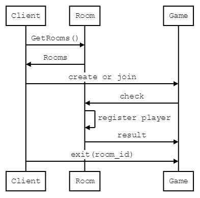

# reversi

## api
POST /api/v1/rooms
- create room
req val
owner_name :string

ret val
room_id :string

GET /api/v1/rooms/:id

## scheme
- Player(mongo)
name :string NonNull
player_id :string NonNUll

- Room(mongo)
player_names :string[2]
    できないなら
    balck_player_name :string
    white_player_name :string
spectator_names :string[]

- Game(redis)
field :int[64]
state :int

シーケンス図


```sequence
Client->Room:GetRooms()
Room->Client:Rooms
Client->Game:create or join
Game->Room:validate player
Room->Room:register player
Room->Game:validation result
Client->Game:exit(room_id)
```